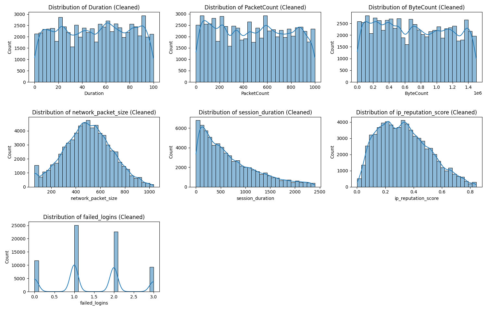

# University of Prishtina “Hasan Prishtina” 

*Faculty of Electrical and Computer Engineering*  
**Level:** Master  
**Course:** Machine Learning  
**Project Title:** Cybersecurity Intrusion Detection Dataset  

**Team Members:**  
- Alma Latifi  
- Endrit Balaj  
- Rinesa Bislimi 

---
The Cybersecurity Intrusion Detection Dataset contains network traffic data designed for detecting cyber threats and intrusions. It includes various network features such as packet headers, protocol types, and traffic patterns, enabling the training and evaluation of machine learning models for intrusion detection. 

---
# Data Dictionary and Example Dataset

## Data Dictionary (Columns Explanation)

| **Column Name**  | **Description** |
|---------------|--------------|
| **Duration** | Total duration of the session in seconds. |
| **Protocol** | Network protocol used (e.g., TCP, UDP, ICMP). |
| **SourceIP** | IP address of the sender. |
| **DestinationIP** | IP address of the receiver. |
| **SourcePort** | Port number of the sender. |
| **DestinationPort** | Port number of the receiver. |
| **PacketCount** | Number of packets exchanged in the session. |
| **ByteCount** | Total number of bytes exchanged. |
| **Label** | Classification label indicating normal or attack activity. |
| **session_id** | Unique identifier for each session (e.g., SID_00001). |
| **network_packet_size** | Size of network packets in bytes. |
| **protocol_type** | Communication protocol used (e.g., TCP, UDP, ICMP). |
| **login_attempts** | Number of login attempts during the session. |
| **session_duration** | Length of the session in seconds. |
| **encryption_used** | Type of encryption used (AES, DES, or None). |
| **ip_reputation_score** | Score between 0 and 1 indicating how suspicious the IP is. |
| **failed_logins** | Number of failed login attempts. |
| **browser_type** | Browser used for the session (e.g., Edge, Firefox). |
| **unusual_time_access** | Binary flag (0 or 1) indicating unusual access time. |
| **attack_detected** | Target variable: 1 means an attack was detected, 0 means normal activity. |

---

## Example Data

```plaintext
| session_id  | network_packet_size | protocol_type | login_attempts | session_duration | encryption_used | ip_reputation_score | failed_logins | browser_type | unusual_time_access | attack_detected |
|------------|----------------------|---------------|----------------|------------------|-----------------|----------------------|--------------|-------------|----------------------|-----------------|
| SID_00001  | 512                  | TCP           | 2              | 360.5            | AES             | 0.75                 | 1            | Chrome      | 0                    | 1               |
| SID_00002  | 204                  | UDP           | 0              | 120.8            | None            | 0.20                 | 0            | Firefox     | 1                    | 0               |
```

---

## Preprocessing - Phase I

### Data Types
```
Duration               float64
Protocol                object
SourceIP                object
DestinationIP           object
SourcePort               int64
DestinationPort          int64
PacketCount              int64
ByteCount                int64
Label                   object
session_id              object
network_packet_size      int64
protocol_type           object
login_attempts           int64
session_duration       float64
encryption_used         object
ip_reputation_score    float64
failed_logins            int64
browser_type            object
unusual_time_access      int64
attack_detected          int64
```

### Data Quality Overview
```
Total Entries: 90000
Total Columns: 20
Memory Usage: 13.7+ MB
```

### Number of Complete (Non-Null) Values
```
Duration               90000
Protocol               90000
SourceIP               90000
DestinationIP          90000
SourcePort             90000
DestinationPort        90000
PacketCount            90000
ByteCount              90000
Label                  90000
session_id             90000
network_packet_size    90000
protocol_type          90000
login_attempts         90000
session_duration       90000
encryption_used        90000
ip_reputation_score    90000
failed_logins          90000
browser_type           90000
unusual_time_access    90000
attack_detected        90000
```

### Number of Null (Missing) Values
```
Duration               0
Protocol               0
SourceIP               0
DestinationIP          0
SourcePort             0
DestinationPort        0
PacketCount            0
ByteCount              0
Label                  0
session_id             0
network_packet_size    0
protocol_type          0
login_attempts         0
session_duration       0
encryption_used        0
ip_reputation_score    0
failed_logins          0
browser_type           0
unusual_time_access    0
attack_detected        0
```

### Number of Outliers per Column
```
Duration                   0
SourcePort                 0
DestinationPort            0
PacketCount                0
ByteCount                  0
network_packet_size      390
login_attempts          1907
session_duration        4071
ip_reputation_score      198
failed_logins           3076
unusual_time_access    13558
attack_detected            0
```


### Skewness of Numerical Features
```
+---------------------+----------------------+
|       Feature       |       Skewness       |
+---------------------+----------------------+
|      Duration       | -0.02639010700695097 |
|     PacketCount     | 0.03696066855042498  |
|      ByteCount      | 0.08443791337484031  |
| network_packet_size | 0.09023634803478615  |
|  session_duration   |  2.105476672780381   |
| ip_reputation_score | 0.47193398778619305  |
|    failed_logins    |  0.3940639081082175  |
+---------------------+----------------------+
```

### Skewness of Numerical Features (After Transformation)
```
+---------------------+----------------------+
|       Feature       |       Skewness       |
+---------------------+----------------------+
|      Duration       | -0.2689631902215022  |
|     PacketCount     | -0.28405725959531425 |
|      ByteCount      | -0.2710843070081188  |
| network_packet_size | -0.07553539857509789 |
|  session_duration   | -0.09815358842221457 |
| ip_reputation_score | 0.024647508046220106 |
|    failed_logins    | -0.08708794457163305 |
+---------------------+----------------------+
---
### Number of Outliers per Column (After Preprocessing)
```
+---------------------+--------------------+
|       Feature       | Outliers Remaining |
+---------------------+--------------------+
|      Duration       |         0          |
|     PacketCount     |         0          |
|      ByteCount      |         0          |
| network_packet_size |         0          |
|  session_duration   |         0          |
| ip_reputation_score |         0          |
|    failed_logins    |         0          |
+---------------------+--------------------+
---
### Comparison of Class Distribution Before and After SMOTE
```

+--------+--------------+-------------+
| Label  | Count_Before | Count_After |
+--------+--------------+-------------+
| Attack |    31803     |    31803    |
| Normal |    28074     |    31803    |
+--------+--------------+-------------+
---
**Figure: Feature Distributions in the Cybersecurity Intrusion Detection Dataset**

- Before removing outliers
  


- After removing outliers
  


The figures display histograms of key network traffic features, providing insights into their distributions and potential anomalies.

- `Duration`, `PacketCount`, and `ByteCount` exhibit uniform or near-uniform distributions, suggesting a wide range of network session activities.
- `Network Packet Size`and `IP Reputation Score` show skewed distributions, indicating possible concentration of values within certain ranges.
- `Session Duration` follows a right-skewed pattern, with most sessions being short.
- `Failed Logins` display distinct peaks, likely corresponding to different attack or user behavior patterns.

These visualizations help identify trends and irregularities, crucial for training machine learning models in intrusion detection.