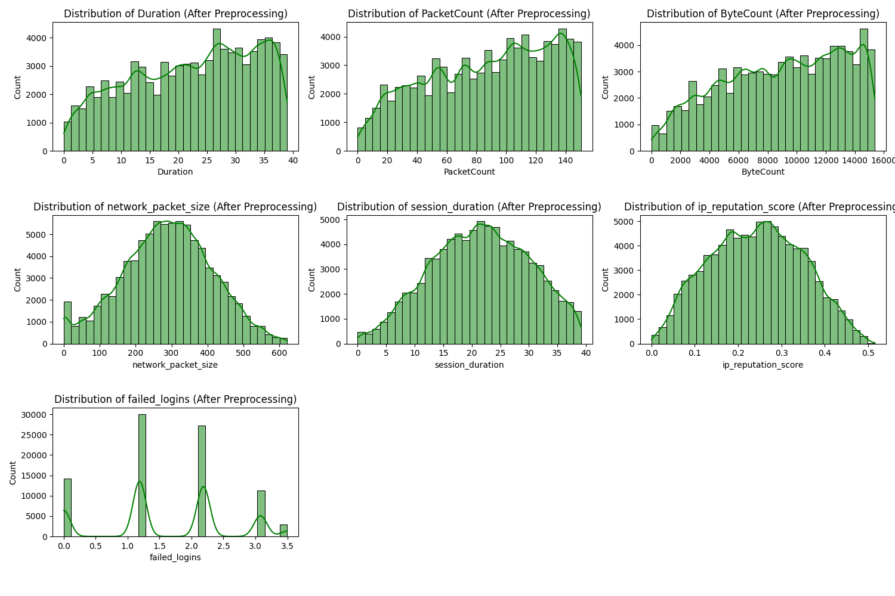
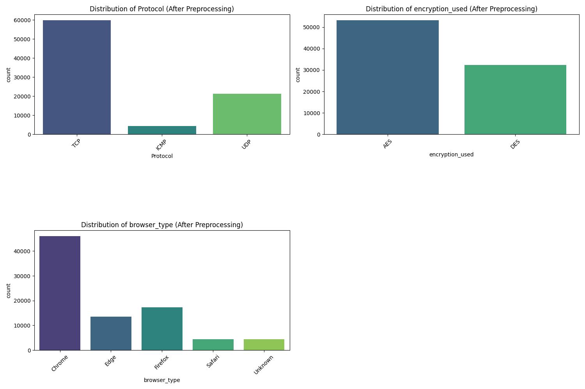
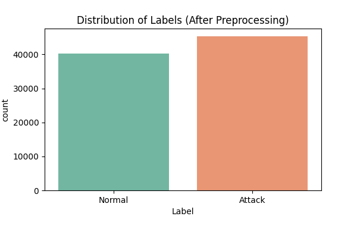
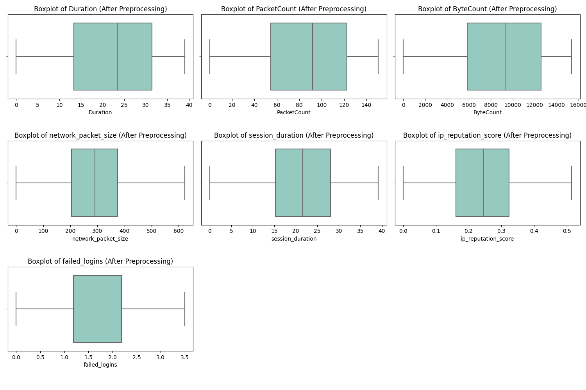
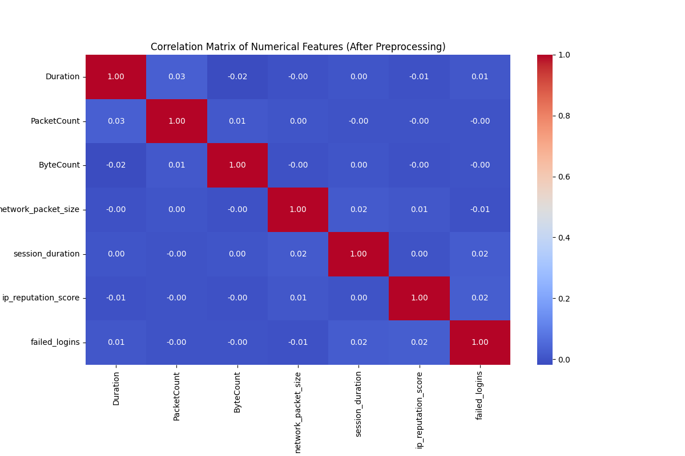

# University of Prishtina “Hasan Prishtina” 

*Faculty of Electrical and Computer Engineering*  
**Level:** Master  
**Course:** Machine Learning  
**Project Title:** Intrusion Detection  
**Professor:** Prof. Dr. Lule Ahmedi  
**Assistant:** Dr. Sc. Mërgim H. Hoti  

**Team Members :**  
- Alma Latifi  
- Endrit Balaj  
- Rinesa Bislimi 

---
By combining two cybersecurity datasets from **Kaggle**—[Intrusion Detection Dataset ](https://www.kaggle.com/datasets/dnkumars/cybersecurity-intrusion-detection-dataset) and [Network Traffic Dataset](https://www.kaggle.com/datasets/mohdzia356/network-traffic-data-for-intrusion-detection)—we have created a comprehensive and enriched dataset to improve the detection of cyber threats and attacks. This merged dataset includes detailed network traffic information, such as packet headers, protocol types, and traffic patterns, providing a robust foundation for analyzing and identifying intrusions. Designed to train and evaluate machine learning models, this dataset enhances their ability to detect and prevent cyberattacks effectively. The combined dataset consists of **20 columns** and **90,000 rows**, offering a rich resource for advancing cybersecurity research and threat mitigation.

---
# Data Dictionary and Example Dataset

## Data Dictionary (Columns Explanation)

| **Column Name**  | **Description** |
|---------------|--------------|
| **Duration** | Total duration of the session in seconds. |
| **Protocol** | Network protocol used (e.g., TCP, UDP, ICMP). |
| **SourceIP** | IP address of the sender. |
| **DestinationIP** | IP address of the receiver. |
| **SourcePort** | Port number of the sender. |
| **DestinationPort** | Port number of the receiver. |
| **PacketCount** | Number of packets exchanged in the session. |
| **ByteCount** | Total number of bytes exchanged. |
| **Label** | Classification label indicating normal or attack activity. |
| **session_id** | Unique identifier for each session (e.g., SID_00001). |
| **network_packet_size** | Size of network packets in bytes. |
| **protocol_type** | Communication protocol used (e.g., TCP, UDP, ICMP). |
| **login_attempts** | Number of login attempts during the session. |
| **session_duration** | Length of the session in seconds. |
| **encryption_used** | Type of encryption used (AES, DES, or None). |
| **ip_reputation_score** | Score between 0 and 1 indicating how suspicious the IP is. |
| **failed_logins** | Number of failed login attempts. |
| **browser_type** | Browser used for the session (e.g., Edge, Firefox). |
| **unusual_time_access** | Binary flag (0 or 1) indicating unusual access time. |
| **attack_detected** | Target variable: 1 means an attack was detected, 0 means normal activity. |

---

## Example Data

```plaintext
| session_id  | network_packet_size | protocol_type | login_attempts | session_duration | encryption_used | ip_reputation_score | failed_logins | browser_type | unusual_time_access | attack_detected |
|------------|----------------------|---------------|----------------|------------------|-----------------|----------------------|--------------|-------------|----------------------|-----------------|
| SID_00001  | 512                  | TCP           | 2              | 360.5            | AES             | 0.75                 | 1            | Chrome      | 0                    | 1               |
| SID_00002  | 204                  | UDP           | 0              | 120.8            | None            | 0.20                 | 0            | Firefox     | 1                    | 0               |
```

---

## Preprocessing - Phase I

### Data Types
```
Duration               float64
Protocol                object
SourceIP                object
DestinationIP           object
SourcePort               int64
DestinationPort          int64
PacketCount              int64
ByteCount                int64
Label                   object
session_id              object
network_packet_size      int64
protocol_type           object
login_attempts           int64
session_duration       float64
encryption_used         object
ip_reputation_score    float64
failed_logins            int64
browser_type            object
unusual_time_access      int64
attack_detected          int64
```

### Data Quality Overview
```
Total Entries: 90000
Total Columns: 20
Memory Usage: 13.7+ MB
```

### Number of Complete (Non-Null) Values
```
Duration               90000
Protocol               90000
SourceIP               90000
DestinationIP          90000
SourcePort             90000
DestinationPort        90000
PacketCount            90000
ByteCount              90000
Label                  90000
session_id             90000
network_packet_size    90000
protocol_type          90000
login_attempts         90000
session_duration       90000
encryption_used        90000
ip_reputation_score    90000
failed_logins          90000
browser_type           90000
unusual_time_access    90000
attack_detected        90000
```

### Number of Null (Missing) Values
```
Duration               0
Protocol               0
SourceIP               0
DestinationIP          0
SourcePort             0
DestinationPort        0
PacketCount            0
ByteCount              0
Label                  0
session_id             0
network_packet_size    0
protocol_type          0
login_attempts         0
session_duration       0
encryption_used        0
ip_reputation_score    0
failed_logins          0
browser_type           0
unusual_time_access    0
attack_detected        0
```

### Number of Outliers per Column
```
Duration                   0
SourcePort                 0
DestinationPort            0
PacketCount                0
ByteCount                  0
network_packet_size      390
login_attempts          1907
session_duration        4071
ip_reputation_score      198
failed_logins           3076
unusual_time_access    13558
attack_detected            0
```


### Skewness of Numerical Features
```
+---------------------+----------------------+
|       Feature       |       Skewness       |
+---------------------+----------------------+
|      Duration       | -0.02639010700695097 |
|     PacketCount     | 0.03696066855042498  |
|      ByteCount      | 0.08443791337484031  |
| network_packet_size | 0.09023634803478615  |
|  session_duration   |  2.105476672780381   |
| ip_reputation_score | 0.47193398778619305  |
|    failed_logins    |  0.3940639081082175  |
+---------------------+----------------------+
```
### Skewness direction of Numerical Features
```
+---------------------+--------------------+
|       Feature       | Skewness Direction |
+---------------------+--------------------+
|      Duration       |    Left Skewed     |
|     PacketCount     |    Right Skewed    |
|      ByteCount      |    Right Skewed    |
| network_packet_size |    Right Skewed    |
|  session_duration   |    Right Skewed    |
| ip_reputation_score |    Right Skewed    |
|    failed_logins    |    Right Skewed    |
+---------------------+--------------------+
```

### Skewness of Numerical Features (After Transformation)
```
+---------------------+----------------------+
|       Feature       |       Skewness       |
+---------------------+----------------------+
|      Duration       | -0.2689631902215022  |
|     PacketCount     | -0.28405725959531425 |
|      ByteCount      | -0.2710843070081188  |
| network_packet_size | -0.07553539857509789 |
|  session_duration   | -0.09815358842221457 |
| ip_reputation_score | 0.024647508046220106 |
|    failed_logins    | -0.08708794457163305 |
+---------------------+----------------------+
```
### Number of Outliers per Column (After Preprocessing)
```
+---------------------+--------------------+
|       Feature       | Outliers Remaining |
+---------------------+--------------------+
|      Duration       |         0          |
|     PacketCount     |         0          |
|      ByteCount      |         0          |
| network_packet_size |         0          |
|  session_duration   |         0          |
| ip_reputation_score |         0          |
|    failed_logins    |         0          |
+---------------------+--------------------+
```
### Comparison of Class Distribution Before and After SMOTE
```
+--------+--------------+-------------+
| Label  | Count_Before | Count_After |
+--------+--------------+-------------+
| Attack |    31803     |    31803    |
| Normal |    28074     |    31803    |
+--------+--------------+-------------+
```
---
**Figure: Feature Distributions in the Cybersecurity Intrusion Detection Dataset**




This image contains a series of histograms that visualize the distribution of various network metrics after preprocessing. Each histogram provides insights into the frequency distribution of a specific network-related feature. Below is a brief description of each histogram:

Distribution of `Duration`: Shows the frequency of different durations (in seconds) observed in the network data. The x-axis represents the duration, and the y-axis represents the count of occurrences.

Distribution of `PacketCount`: Illustrates the frequency of different packet counts per session. The x-axis represents the number of packets, and the y-axis represents the count of occurrences.

Distribution of `BytesCount`: Displays the frequency of different byte counts per session. The x-axis represents the number of bytes, and the y-axis represents the count of occurrences.

Distribution of `network_packet_size`: Represents the frequency of different packet sizes (in bytes). The x-axis represents the packet size, and the y-axis represents the count of occurrences.

Distribution of `session_duration`: Similar to the Duration histogram, this shows the frequency of different session durations (in seconds). The x-axis represents the session duration, and the y-axis represents the count of occurrences.

Distribution of `ip_reputation_score`: Visualizes the frequency of different IP reputation scores. The x-axis represents the reputation score, and the y-axis represents the count of occurrences.

Distribution of `failed_logins`: Shows the frequency of different counts of failed login attempts. The x-axis represents the number of failed logins, and the y-axis represents the count of occurrences.


**Figure:  Distribution of Network Protocol, Encryption, and Interest Type (After Preprocessing)**



This image presents histograms showing the distribution of network protocols, encryption methods, and interest types after preprocessing. Each histogram provides a count of occurrences for different categories, aiding in the analysis of network traffic patterns and security configurations.

 **Figure:  Distribution of Network Labels (After Preprocessing)**

 

This image displays the distribution of network labels, distinguishing between normal activities and attacks. It provides a clear visual representation of the balance or imbalance between these categories after preprocessing, which is essential for network security analysis and anomaly detection.

 **Figure:  Boxplots of Key Network and Security Metrics (After Preprocessing)**

 

 This image shows boxplots of key network and security metrics after preprocessing. It helps visualize data distribution and detect any outliers in parameters like session duration, packet count, byte count, and failed logins.


 **Figure: Correlation Matrix of Numerical Features**



This heatmap displays the correlation between different numerical features after preprocessing. The color scale indicates the strength of relationships between variables, helping to identify patterns and dependencies in the data.

---
## Analysis and Evaluation (Retraining) - Phase II
