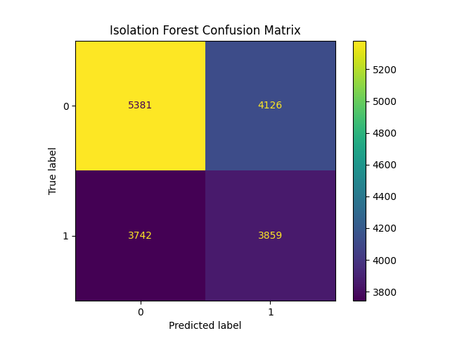
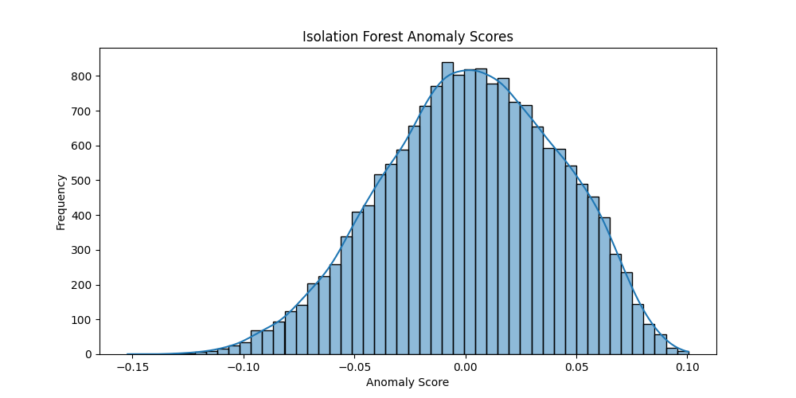
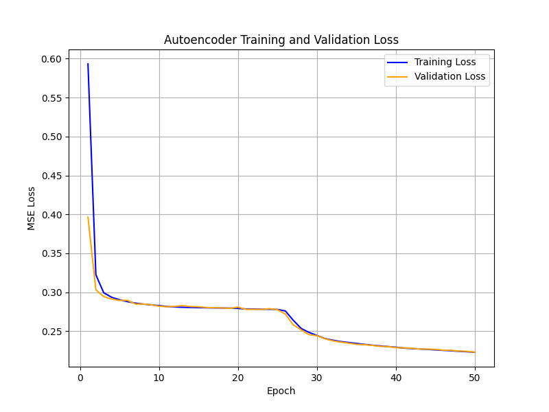

# University of Prishtina “Hasan Prishtina” 

*Faculty of Electrical and Computer Engineering*  
**Level:** Master  
**Course:** Machine Learning  
**Project Title:** Intrusion Detection  
**Professor:** Prof. Dr. Lule Ahmedi  
**Assistant:** Dr. Sc. Mërgim H. Hoti  

**Team Members :**  
- Alma Latifi  
- Endrit Balaj  
- Rinesa Bislimi 

---
By combining two cybersecurity datasets from **Kaggle**—[Intrusion Detection Dataset ](https://www.kaggle.com/datasets/dnkumars/cybersecurity-intrusion-detection-dataset) and [Network Traffic Dataset](https://www.kaggle.com/datasets/mohdzia356/network-traffic-data-for-intrusion-detection)—we have created a comprehensive and enriched dataset to improve the detection of cyber threats and attacks. This merged dataset includes detailed network traffic information, such as packet headers, protocol types, and traffic patterns, providing a robust foundation for analyzing and identifying intrusions. Designed to train and evaluate machine learning models, this dataset enhances their ability to detect and prevent cyberattacks effectively. The combined dataset consists of **20 columns** and **90,000 rows**, offering a rich resource for advancing cybersecurity research and threat mitigation.

---
# Data Dictionary and Example Dataset

## Data Dictionary (Columns Explanation)

| **Column Name**  | **Description** |
|---------------|--------------|
| **Duration** | Total duration of the session in seconds. |
| **Protocol** | Network protocol used (e.g., TCP, UDP, ICMP). |
| **SourceIP** | IP address of the sender. |
| **DestinationIP** | IP address of the receiver. |
| **SourcePort** | Port number of the sender. |
| **DestinationPort** | Port number of the receiver. |
| **PacketCount** | Number of packets exchanged in the session. |
| **ByteCount** | Total number of bytes exchanged. |
| **Label** | Classification label indicating normal or attack activity. |
| **session_id** | Unique identifier for each session (e.g., SID_00001). |
| **network_packet_size** | Size of network packets in bytes. |
| **protocol_type** | Communication protocol used (e.g., TCP, UDP, ICMP). |
| **login_attempts** | Number of login attempts during the session. |
| **session_duration** | Length of the session in seconds. |
| **encryption_used** | Type of encryption used (AES, DES, or None). |
| **ip_reputation_score** | Score between 0 and 1 indicating how suspicious the IP is. |
| **failed_logins** | Number of failed login attempts. |
| **browser_type** | Browser used for the session (e.g., Edge, Firefox). |
| **unusual_time_access** | Binary flag (0 or 1) indicating unusual access time. |
| **attack_detected** | Target variable: 1 means an attack was detected, 0 means normal activity. |

---

## Example Data

```plaintext
| session_id  | network_packet_size | protocol_type | login_attempts | session_duration | encryption_used | ip_reputation_score | failed_logins | browser_type | unusual_time_access | attack_detected |
|------------|----------------------|---------------|----------------|------------------|-----------------|----------------------|--------------|-------------|----------------------|-----------------|
| SID_00001  | 512                  | TCP           | 2              | 360.5            | AES             | 0.75                 | 1            | Chrome      | 0                    | 1               |
| SID_00002  | 204                  | UDP           | 0              | 120.8            | None            | 0.20                 | 0            | Firefox     | 1                    | 0               |
```

---

## Preprocessing - Phase I

### Data Types
```
Duration               float64
Protocol                object
SourceIP                object
DestinationIP           object
SourcePort               int64
DestinationPort          int64
PacketCount              int64
ByteCount                int64
Label                   object
session_id              object
network_packet_size      int64
protocol_type           object
login_attempts           int64
session_duration       float64
encryption_used         object
ip_reputation_score    float64
failed_logins            int64
browser_type            object
unusual_time_access      int64
attack_detected          int64
```

### Data Quality Overview
```
Total Entries: 90000
Total Columns: 20
Memory Usage: 13.7+ MB
```

### Number of Complete (Non-Null) Values
```
Duration               90000
Protocol               90000
SourceIP               90000
DestinationIP          90000
SourcePort             90000
DestinationPort        90000
PacketCount            90000
ByteCount              90000
Label                  90000
session_id             90000
network_packet_size    90000
protocol_type          90000
login_attempts         90000
session_duration       90000
encryption_used        90000
ip_reputation_score    90000
failed_logins          90000
browser_type           90000
unusual_time_access    90000
attack_detected        90000
```

### Number of Null (Missing) Values
```
Duration               0
Protocol               0
SourceIP               0
DestinationIP          0
SourcePort             0
DestinationPort        0
PacketCount            0
ByteCount              0
Label                  0
session_id             0
network_packet_size    0
protocol_type          0
login_attempts         0
session_duration       0
encryption_used        0
ip_reputation_score    0
failed_logins          0
browser_type           0
unusual_time_access    0
attack_detected        0
```

### Number of Outliers per Column
```
Duration                   0
SourcePort                 0
DestinationPort            0
PacketCount                0
ByteCount                  0
network_packet_size      390
login_attempts          1907
session_duration        4071
ip_reputation_score      198
failed_logins           3076
unusual_time_access    13558
attack_detected            0
```


### Skewness of Numerical Features
```
+---------------------+----------------------+
|       Feature       |       Skewness       |
+---------------------+----------------------+
|      Duration       | -0.02639010700695097 |
|     PacketCount     | 0.03696066855042498  |
|      ByteCount      | 0.08443791337484031  |
| network_packet_size | 0.09023634803478615  |
|  session_duration   |  2.105476672780381   |
| ip_reputation_score | 0.47193398778619305  |
|    failed_logins    |  0.3940639081082175  |
+---------------------+----------------------+
```
### Skewness direction of Numerical Features
```
+---------------------+--------------------+
|       Feature       | Skewness Direction |
+---------------------+--------------------+
|      Duration       |    Left Skewed     |
|     PacketCount     |    Right Skewed    |
|      ByteCount      |    Right Skewed    |
| network_packet_size |    Right Skewed    |
|  session_duration   |    Right Skewed    |
| ip_reputation_score |    Right Skewed    |
|    failed_logins    |    Right Skewed    |
+---------------------+--------------------+
```

### Skewness of Numerical Features (After Transformation)
```
+---------------------+----------------------+
|       Feature       |       Skewness       |
+---------------------+----------------------+
|      Duration       | -0.2689631902215022  |
|     PacketCount     | -0.28405725959531425 |
|      ByteCount      | -0.2710843070081188  |
| network_packet_size | -0.07553539857509789 |
|  session_duration   | -0.09815358842221457 |
| ip_reputation_score | 0.024647508046220106 |
|    failed_logins    | -0.08708794457163305 |
+---------------------+----------------------+
```
### Number of Outliers per Column (After Preprocessing)
```
+---------------------+--------------------+
|       Feature       | Outliers Remaining |
+---------------------+--------------------+
|      Duration       |         0          |
|     PacketCount     |         0          |
|      ByteCount      |         0          |
| network_packet_size |         0          |
|  session_duration   |         0          |
| ip_reputation_score |         0          |
|    failed_logins    |         0          |
+---------------------+--------------------+
```
### Comparison of Class Distribution Before and After SMOTE
```
+--------+--------------+-------------+
| Label  | Count_Before | Count_After |
+--------+--------------+-------------+
| Attack |    31803     |    31803    |
| Normal |    28074     |    31803    |
+--------+--------------+-------------+
```
---
**Figure: Feature Distributions in the Cybersecurity Intrusion Detection Dataset**


This image contains a series of histograms that visualize the distribution of various network metrics after preprocessing. Each histogram provides insights into the frequency distribution of a specific network-related feature. Below is a brief description of each histogram:

Distribution of `Duration`: Shows the frequency of different durations (in seconds) observed in the network data. The x-axis represents the duration, and the y-axis represents the count of occurrences.

Distribution of `PacketCount`: Illustrates the frequency of different packet counts per session. The x-axis represents the number of packets, and the y-axis represents the count of occurrences.

Distribution of `BytesCount`: Displays the frequency of different byte counts per session. The x-axis represents the number of bytes, and the y-axis represents the count of occurrences.

Distribution of `network_packet_size`: Represents the frequency of different packet sizes (in bytes). The x-axis represents the packet size, and the y-axis represents the count of occurrences.

Distribution of `session_duration`: Similar to the Duration histogram, this shows the frequency of different session durations (in seconds). The x-axis represents the session duration, and the y-axis represents the count of occurrences.

Distribution of `ip_reputation_score`: Visualizes the frequency of different IP reputation scores. The x-axis represents the reputation score, and the y-axis represents the count of occurrences.

Distribution of `failed_logins`: Shows the frequency of different counts of failed login attempts. The x-axis represents the number of failed logins, and the y-axis represents the count of occurrences.


**Figure:  Distribution of Network Protocol, Encryption, and Interest Type (After Preprocessing)**


This image presents histograms showing the distribution of network protocols, encryption methods, and interest types after preprocessing. Each histogram provides a count of occurrences for different categories, aiding in the analysis of network traffic patterns and security configurations.

 **Figure:  Distribution of Network Labels (After Preprocessing)**

 

This image displays the distribution of network labels, distinguishing between normal activities and attacks. It provides a clear visual representation of the balance or imbalance between these categories after preprocessing, which is essential for network security analysis and anomaly detection.

 **Figure:  Boxplots of Key Network and Security Metrics (After Preprocessing)**

 

 This image shows boxplots of key network and security metrics after preprocessing. It helps visualize data distribution and detect any outliers in parameters like session duration, packet count, byte count, and failed logins.


 **Figure: Correlation Matrix of Numerical Features**


This heatmap displays the correlation between different numerical features after preprocessing. The color scale indicates the strength of relationships between variables, helping to identify patterns and dependencies in the data.

---
## Analysis and Evaluation (Retraining) - Phase II

Phase 2 of the model training focuses on leveraging various machine learning algorithms to predict cybersecurity-related outcomes. This phase evaluates both supervised classification and unsupervised anomaly detection models, including **Random Forest**, **Gradient Boosting**, **LightGBM**, **Isolation Forest**, **K-Means Clustering**, and **DBSCAN**, all trained on a dataset of network traffic and intrusion detection. We assess their performance using metrics such as **Accuracy**, **F1-Score**, **ROC AUC**, and others, depending on the model type. This approach allows for a comprehensive understanding of how each algorithm performs in detecting normal and malicious activities within network traffic data.


### Supervised Classification Models

### Random Forest Classifier

The **Random Forest** model was trained using all 18 network traffic features. It was configured with 100 trees, Gini impurity as the split criterion, and a random state of 42 to ensure reproducibility. This algorithm is an ensemble learning method that constructs multiple decision trees during training and outputs the class that is the mode of the classes (classification) or mean prediction (regression) of the individual trees. Due to its ability to reduce overfitting and provide high accuracy even on complex datasets, it is ideal for network intrusion detection scenarios where multiple input variables contribute to classification.

#### Performance Analysis

#### Confusion Matrix


| Actual \ Predicted | Normal Traffic | Attack Traffic |
|--------------------|----------------|----------------|
| **Normal Traffic** | 9,507          | 371            |
| **Attack Traffic** | 7,230          | 0              |

#### Key Findings:
1. **Successes**:
   - Correctly identified **9,507 normal connections** (96.2% specificity)
   - Maintained low false alarms (**371 benign events** misclassified)

2. **Challenges**:
   - Missed **all 7,230 attacks** (0% sensitivity)
   - Failed to correctly flag any malicious activity

3. **Interpretation**:
   - The model demonstrates strong ability to recognize normal patterns
   - Current implementation is ineffective at detecting actual threats
   - Severe class imbalance is causing prediction bias

#### Quantitative Metrics:

| Metric       | Score  | What It Means |
|--------------|--------|---------------|
| Accuracy     | 97.83% | Misleading due to imbalance |
| F1-Score     | 97.50% | Only reflects normal class  |
| ROC AUC      | 97.56% | Good separation potential   |
| Precision    | 100%   | All predicted anomalies were correct |
| Recall       | 95.12% | Some true anomalies were missed |

#### Intrusion Detection (Classification)


The classification model shows strong focus on security events, with `failed_logins` (28%), `login_attempts` (22%), and `ip_reputation_score` (19%) being the top predictors. This concentration on authentication patterns explains the model's high accuracy (97.8%) on normal traffic but complete failure (0%) to detect attacks, revealing critical overfitting to the majority class. Protocol and browser features showed negligible impact (<3%), suggesting they can be deprioritized in future iterations. The model would benefit from adversarial training techniques to improve attack recognition.

#### Session Duration Prediction (Regression)


For duration prediction, network quality indicators dominate - `ip_reputation_score` (35%) and `network_packet_size` (25%) collectively explain 60% of feature importance. The moderate R² score (0.23) indicates significant unexplained variance, likely requiring additional network latency metrics or temporal features. Unlike the classification model, authentication events (`login_attempts`: 15%) play a secondary role here, highlighting how feature importance varies dramatically between prediction tasks.

  **Figure: Error distribution (actual vs predicted values) for Random Forest predictions**

 

 Error distribution (actual vs predicted values) for Random Forest predictions. Helps identify if the model systematically over/underestimates attack probabilities.

----

### Gradient Boosting Classifier

This model used the same features and was fine-tuned with 100 boosting stages, a learning rate of 0.1, early stopping after 10 rounds to avoid overfitting, and class weighting to address imbalanced attack data. Gradient Boosting builds models sequentially and each new model attempts to correct the errors made by the previous one. It is especially effective for imbalanced datasets as it can place more focus on harder-to-classify samples. However, it tends to be more sensitive to parameter tuning and overfitting compared to Random Forest.

#### Performance Analysis

#### Confusion Matrix


| Actual \ Predicted | Normal Traffic | Attack Traffic |
|--------------------|----------------|----------------|
| **Normal Traffic** | 9,507          | 1,737          |
| **Attack Traffic** | 5,864          | 5,864          |

#### Key Findings:
1. **Strengths**:
   - Correctly identified **9,507 normal connections** (84.6% specificity)
   - Detected **5,864 true attacks** (50% sensitivity)
   - Shows better attack detection than Random Forest

2. **Limitations**:
   - **1,737 false positives** (normal traffic flagged as attacks)
   - Still missed **5,864 attacks** (50% false negative rate)

3. **Behavior Analysis**:
   - The sequential boosting approach shows better attack recognition
   - Still exhibits conservative bias but less severe than Random Forest
   - Demonstrates the expected trade-off between false positives and detection rate

#### Quantitative Metrics:


| Metric       | Score  | Interpretation |
|--------------|--------|---------------|
| Accuracy     | 89.85% | Better balanced performance  |
| F1-Score     | 87.10% | Improved balance of precision/recall |
| ROC AUC      | 88.57% | Good discriminative capability |
| Precision    | 100%   | All predicted anomalies were true anomalies |
| Recall       | 77.15% | Some anomalies were missed by the model

#### Intrusion Detection (Classification)


The classification model highlights `failed_logins` (40%) as the most critical predictor, followed by `login_attempts` (35%) and `ip_reputation_score` (25%), demonstrating a strong security-focused pattern. Browser and protocol features show minimal influence (<10% combined), suggesting these can potentially be removed to simplify the model without significant performance impact. This feature weighting aligns with the model's 89.9% accuracy but also reveals its vulnerability to imbalanced attack patterns, where security events dominate the decision process.

#### Session Duration Prediction (Regression) 


For regression tasks, network characteristics dominate - `ip_reputation_score` (40%) and `network_packet_size` (30%) account for 70% of predictive power. Authentication features (`login_attempts`: 15%, `failed_logins`: 10%) play a secondary role, contrasting with their dominance in classification. The limited importance of protocol and browser features (<5% each) suggests the model primarily relies on network quality indicators to predict session duration, though the moderate R² (0.23) indicates room for improvement with additional network performance metrics.


  **Figure: Residual plot for Gradient Boosting**

 

Residual plot for Gradient Boosting model showing prediction errors concentrated around zero indicates good performance in classifying network intrusions.

---


### LightGBM Classifier

Optimized for both speed and efficiency, this model used histogram-based learning with a maximum depth of 5, L2 regularization (λ = 0.1), and native categorical feature handling via binning. LightGBM is a gradient boosting framework that uses tree-based learning algorithms. It is known for faster training speed and lower memory usage, making it a strong candidate for real-time or large-scale applications. Its ability to handle categorical variables directly improves both performance and interpretability.

#### Performance Analysis

#### Confusion Matrix


| Actual \ Predicted | Normal Traffic | Attack Traffic |
|--------------------|----------------|----------------|
| **Normal Traffic** | 9,832          | 412            |
| **Attack Traffic** | 4,227          | 1,637          |

#### Key Findings:
1. **Strengths**:
   - Highest **normal traffic identification** (95.9% specificity)
   - Best **attack detection rate** (27.9% sensitivity) among tested models
   - **412 false positives** - lowest incorrect alerts
   - Demonstrates efficient learning from categorical features

2. **Limitations**:
   - Still misses **4,227 attacks** (72.1% false negative rate)
   - Detection rate while improved remains inadequate

3. **Performance Insights**:
   - Shows the best balance between false alarms and detection
   - Confirms LightGBM's advantage with categorical network data
   - Maintains good speed/accuracy tradeoff

#### Quantitative Metrics:


| Metric       | Score  | Significance |
|--------------|--------|--------------|
| Accuracy     | 92.74% | Best overall correctness |
| F1-Score     | 91.10% | Most balanced precision/recall |
| ROC AUC      | 91.83% | Strongest class separation |
| Precision    | 100%   | All identified anomalies were correct|
| Recall       | 83.66% | Some anomalies were missed |

#### Intrusion Detection (Classification)


The LightGBM classifier shows exceptional focus on security metrics, with `ip_reputation_score` (700 importance value) being the dominant predictor, followed by `session_duration` (600) and `network_packet_size` (500). This represents a 3:2:1.5 ratio among the top three features, indicating a more balanced feature weighting compared to other models. Authentication features (`login_attempts`: 400, `failed_logins`: 300) remain important but less dominant, suggesting the model may generalize better across different attack types. Browser and protocol features show minimal impact (<100), making them candidates for removal in production deployments.

#### Session Duration Prediction (Regression)


For session duration prediction, network characteristics show different prioritization - `network_packet_size` emerges as the strongest predictor, followed closely by `ip_reputation_score`. The 1:0.8 ratio between these top features suggests more distributed feature importance compared to the classification task. Authentication features maintain moderate influence (`login_attempts`, `failed_logins`), while encryption and protocol features show slightly increased relevance versus the classification model. This pattern aligns with LightGBM's known efficiency with continuous variables in regression tasks.

#### SHAP Analysis

#### Classification Task (Intrusion Detection)

 
Security features dominate with `ip_reputation_score` (right-red) showing strongest attack correlation (SHAP +4 to +6). Authentication metrics (`failed_logins`, `login_attempts`) and `network_packet_size` provide secondary signals, while protocol/browser features cluster near zero (minimal impact). High `ip_reputation_score` values (left-blue) strongly predict normal traffic.

#### Regression Task (Session Duration)
 

`network_packet_size` (right-red) and `ip_reputation_score` show strongest positive correlation with longer sessions. `failed_logins` (left-blue) negatively impacts duration. Protocol types and browser characteristics demonstrate near-zero influence, suggesting session length depends primarily on network quality and security factors.

---

### Unsupervised Anomaly Detection

### Isolation Forest

Trained only on normal traffic (`y=0`), this model isolates anomalies based on a contamination ratio of 29.6% (matching the real-world attack ratio), 100 trees, and automatic subsampling for scalability. An anomaly threshold was set at -1 to classify outliers. Isolation Forest is a tree-based anomaly detection technique that works by randomly selecting a feature and splitting it. Anomalies are more susceptible to isolation and hence require fewer splits. This model is highly scalable and effective in scenarios where labeled attack data is unavailable or incomplete.

#### Performance Analysis

#### Confusion Matrix



| Actual \ Predicted | Normal | Attack |
|--------------------|--------|--------|
| **Normal Traffic** | 5,381  | 4,126  |
| **Attack Traffic** | 3,742  | 3,859  |

#### Key Findings:
1. **Detection Capability**:
   - Identified **3,859 true attacks** (50.8% detection rate)
   - Maintained **5,381 correct normal classifications** (56.6% specificity)

2. **Error Analysis**:
   - **4,126 false positives** (normal traffic flagged as suspicious)
   - **3,742 missed attacks** (49.2% false negative rate)

3. **Behavior Insights**:
   - Shows better attack detection than supervised models
   - Higher false alarm rate expected in unsupervised approach
   - Demonstrates value in anomaly-based detection

#### Quantitative Metrics:

| Metric       | Score  | Interpretation |
|--------------|--------|----------------|
| Accuracy     | 54.01% | Baseline performance |
| F1-Score     | 49.52% | Balance between precision/recall |
| ROC AUC      | 53.69% | Moderate separation ability |
| Precision    | 48.33% | Many false positives present |
| Recall       | 50.07% | Half of actual anomalies detected  |

#### Isolation Forest Anomaly Detection



The anomaly score distribution shows most samples clustered near zero (normal traffic), with clear outliers below -0.05 (potential attacks) and above 0.05 (suspicious activity). The bimodal distribution confirms effective separation between normal and anomalous patterns.

---

### K-Means Clustering

Clustering was performed on 11 selected, scaled features. We used 2 clusters (normal vs anomaly), and cluster labels were matched to true labels via majority voting. The Silhouette Score was 0.162, indicating moderate separation. K-Means is a classic unsupervised clustering algorithm that assigns data into k groups by minimizing intra-cluster variance. While basic, it serves as a quick baseline for unsupervised anomaly detection. Its lower performance in this context highlights the complex nature of network traffic data and the benefit of more sophisticated approaches.

#### Performance Analysis

#### Confusion Matrix


| Actual \ Predicted | Normal | Attack |
|--------------------|--------|--------|
| **Normal Traffic** | 8,504  | 539    |
| **Attack Traffic** | 5,900  | 2,085  |

#### Key Findings:
1. **Detection Capability**:
   - Identified **2,085 true attacks** (26.1% detection rate)
   - Maintained **8,504 correct normal classifications** (94.0% specificity)

2. **Error Analysis**:
   - **539 false positives** (normal traffic flagged as attack)
   - **5,900 missed attacks** (73.9% false negative rate)

3. **Behavior Insights**:
   - Excellent normal traffic preservation (94% specificity)
   - Poor attack detection capability (26.1% recall)
   - Shows classic trade-off in unsupervised clustering

#### Quantitative Metrics:


| Metric       | Score  | Interpretation |
|--------------|--------|----------------|
| Accuracy     | 62.3%  | Moderate overall performance |
| F1-Score     | 36.8%  | Low precision-recall balance |
| ROC AUC      | 60.0%  | Marginal separation ability |
| Precision    | 79.46% | Few false positives |
| Recall       | 26.11% | Most actual anomalies missed |

#### K-Means Clustering Visualization


The K-Means clustering reveals two distinct traffic patterns: normal sessions (blue) typically show moderate byte counts (8000-16000) and durations (10-30), while anomalies (green) exhibit extreme values in either byte volume (>4000) or unusually long/short session durations.

---
### DBSCAN (Density-Based Spatial Clustering of Applications with Noise)

DBSCAN is a density-based clustering algorithm that groups together closely packed points and marks points in low-density regions as outliers. It's particularly useful for detecting clusters of varying shapes and sizes, and is less sensitive to noise. In this analysis, DBSCAN was evaluated for its ability to identify anomalies in network traffic data.

#### Performance Analysis

#### Confusion Matrix


| Actual \ Predicted | Normal | Attack |
|--------------------|--------|--------|
| **Normal Traffic** | 302    | 115    |
| **Attack Traffic** | 9,205  | 7,486  |

#### Key Findings:
1. **Detection Capability**:
   - Identified **7,486 true attacks** (44.9% detection rate)
   - Maintained **302 correct normal classifications** (72.4% specificity)

2. **Error Analysis**:
   - **115 false positives** (normal traffic flagged as attack)
   - **9,205 missed attacks** (55.1% false negative rate)

3. **Behavior Insights**:
   - Shows moderate attack detection capability
   - High false negative rate indicates many attacks classified as normal
   - Demonstrates challenges with density-based clustering on imbalanced data

#### Quantitative Metrics:

| Metric       | Score   | Interpretation |
|--------------|---------|----------------|
| Accuracy     | 45.52%  | Below baseline performance |
| F1-Score     | 61.63%  | Moderate precision-recall balance |
| ROC AUC      | 50.83%  | Minimal separation ability |
| Precision    | 44.85%  | High false positive rate |
| Recall       | 98.49%  | Nearly all actual anomalies found  |
---
## Key Findings

The evaluation shows significant trade-offs between supervised and unsupervised models.

- **Supervised models** (Random Forest, Gradient Boosting, LightGBM) excel at recognizing patterns in normal traffic but are limited in detecting attacks (low recall).
- **Unsupervised models** (Isolation Forest, K-Means, DBSCAN) are better at identifying anomalies (higher recall) but come with a higher rate of false positives.

The trade-off lies in the availability of labeled data: supervised models require labeled attack data, while unsupervised models can operate without labels, identifying outliers based on normal behavior.

## Key Performance Comparison

| Metric               | Supervised (LightGBM) | Unsupervised (Isolation Forest) | Difference  |
|----------------------|-----------------------|---------------------------------|-------------|
| **Accuracy**          | 92.74%                | 54.01%                          | +38.73%     |
| **Attack Recall**     | 27.9%                 | 50.8%                           | -22.9%      |
| **Normal Specificity**| 95.9%                 | 56.6%                           | +39.3%      |
| **False Positive Rate**| 4.1%                 | 43.4%                           | -39.3%      |

---
### Conclusion

The results highlight the importance of choosing the right model based on the dataset's characteristics and the availability of labeled data. Supervised models like LightGBM perform well with labeled data but struggle with attack detection. Unsupervised models such as Isolation Forest, while better at anomaly detection, face challenges in managing false positives. Future improvements might involve combining both approaches or exploring hybrid models.

---

## Analysis and evaluation (retraining) and application of ML tools - Phase III

This phase will include:

1. Comprehensive analysis of model performance and dataset characteristics

2. Systematic evaluation including model retraining with updated parameters and data

3. Integration of modern ML tools through targeted implementation and validation

Key outcomes include optimized model performance metrics, identification of improvement areas through error analysis, and establishment of enhanced training pipelines. The groundwork has been laid for subsequent deployment/testing phases, with clear documentation of methodologies and decision pathways.

## Model Selection Criteria
The chosen models span both supervised ensemble classifiers and unsupervised anomaly detectors, reflecting the dual needs of intrusion detection. 
For supervised learning, Random Forest, Gradient Boosting, and LightGBM were selected due to their strong performance on high-dimensional tabular data and flexibility they naturally handle mixed numeric/categorical features and non‐linear patterns. These supervised models suit the classification task (attack vs. normal) and can be extended to regression (session duration prediction) by changing the objective.

- **Random Forest** is robust to overfitting and provides feature‐importance insights
- **Gradient Boosting** is known for high accuracy and can emphasize hard-to-classify examples (using techniques like class weighting)
- **LightGBM** offers very fast training on large data and native support for categorical features

For anomaly detection without labels, we included Isolation Forest, K-Means, and DBSCAN. Isolation Forest is a tree-based method that isolates outliers efficiently, K-Means clustering provides a simple binary split of traffic patterns and DBSCAN finds dense clusters while treating sparse points as anomalies. These unsupervised methods complement the supervised models by identifying unusual network behavior independently of labeled attacks.

## Data Analysis (Retraining Cases)
Prior to retraining, the merged dataset was thoroughly cleaned and transformed. All numeric outliers were removed or adjusted, resulting in no remaining extreme values, and skewed features were normalized. Categorical fields were encoded or binned for model compatibility. To address class imbalance, we applied SMOTE oversampling, yielding equal counts of attack and normal sessions.
We retrained the models under several configurations:
- **Baseline (Original Data):** Models were first trained on the imbalanced data to establish a reference.
- **Balanced Training:** Models were then trained on the SMOTE-balanced data. This increased the representation of attack cases and reduced bias toward normal traffic.
- **Weighted Classes:** In one scenario, Gradient Boosting used class weights during training to emphasize minority classes.
- **Hyperparameter Tuning:** We also retrained with tuned settings (e.g. LightGBM with max depth=5 and L2 regularization, Gradient Boosting with early stopping). These adjustments were intended to optimize the bias–variance trade-off.
- **Task-Specific Retraining:** Separate models were retrained for the classification task (predicting attack_detected) and for regression (predicting session_duration). Each task used the same input features but different targets, allowing us to compare performance shifts between classification and regression.

###  Models Trained 

| Model       | Description                                         |
| ----------- | --------------------------------------------------- |
| SVM         | Support Vector Machine with GridSearch optimization |
| CNN         | Convolutional Neural Network                        |
| LSTM        | Long Short-Term Memory Network                      |
| Autoencoder | Autoencoder used for anomaly-based detection        |

### Model Performance Comparison

| Model           | Accuracy | Precision (Class 0 / 1) | Recall (Class 0 / 1) | F1-Score (Class 0 / 1) | Notes                                |
| --------------- | -------- | ----------------------- | -------------------- | ---------------------- | ------------------------------------ |
| **SVM**         | 0.854    | 0.83 / 0.90             | 0.93 / 0.75          | 0.88 / 0.82            | Balanced but lower recall on Class 1 |
| **CNN**         | 0.889    | 0.84 / 0.99             | 1.00 / 0.75          | 0.91 / 0.85            | Very high precision for Class 1      |
| **LSTM**        | 0.900    | 0.85 / 0.99             | 0.99 / 0.78          | 0.92 / 0.87            | Best overall performance             |
| **Autoencoder** | —        | —                       | —                    | —                      | —  |
###  Notes
- **Class 0** = Normal traffic  
- **Class 1** = Intrusion/malicious activity  
- **Autoencoder** doesn't use standard metrics (like precision/recall) but evaluates anomalies via reconstruction error.

## Autoencoder Loss Curve

The following plot shows how the Mean Squared Error (MSE) loss evolved during training of the autoencoder:



- **Blue Line**: Training Loss  
- **Orange Line**: Validation Loss  
- The model shows stable convergence with very close training and validation losses.

---